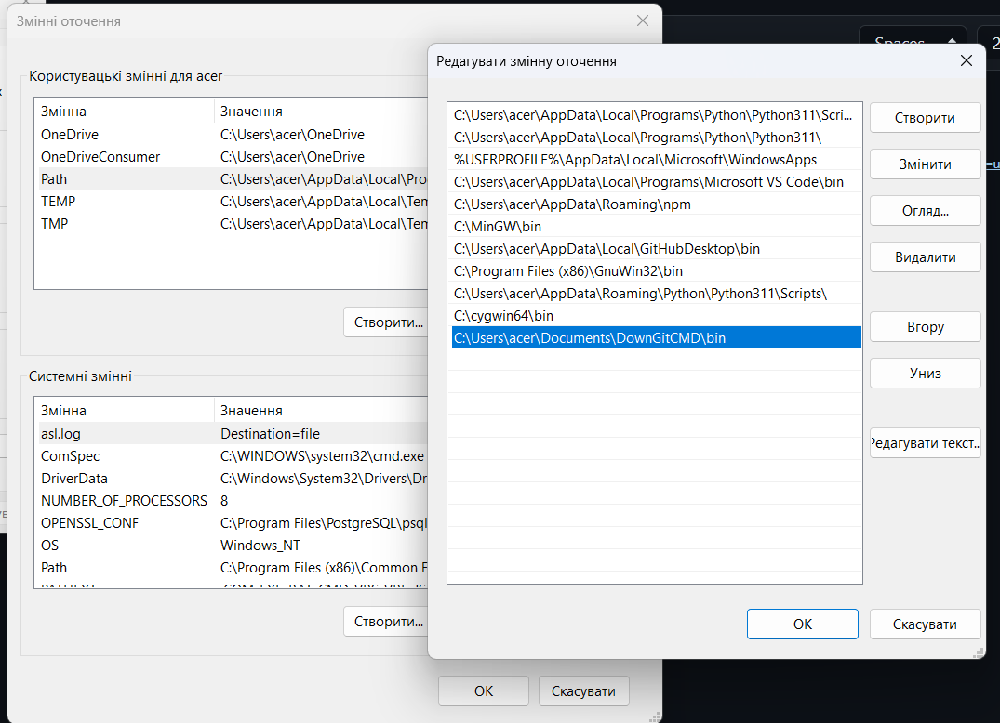

# DownGitCMD

DownGitCMD is a simple and convenient command-line tool that allows users to download GitHub repositories without the need to use the web interface. This program provides access to GitHub repositories through commands, simplifying and speeding up the download process. It also enables users to set their own token to increase the rate limits for API requests to GitHub.
## Installation:
#### 1. Download this repository.
#### 2. Move it to any directory you want.
#### 3. Copy path to bin/ folder. 
Example: C:\Users\User\Documents\DownGitCMD\bin 
#### 4. Add this path to environment variables in Windows, quick guide here -> [Tutorial](https://www.computerhope.com/issues/ch000549.htm)

<p align="center">
  
</p>

#### 5. Open command line and use
## Commands:
```
downgit get
downgit set-token
downgit remove-token
downgit help
```

- get <url> <ignore-files> - The get command allows you to download a GitHub repository by specifying the repository's URL. Optionally, you can specify ignored files, separated by '**;**'. This feature allows users to choose which files they want to download.
    
    Example of use:
    
        downgit get https://github.com/Propsi4/emotions-recognition/tree/main/client "src/App.tsx;src/index.tsx"

- set-token <token> - The set-token command lets you set a personal GitHub token to increase the rate limits for API requests. This is especially useful for users who frequently use this program and want more capabilities for downloading data from GitHub.

- remove-token - The remove-token command allows you to remove a previously set GitHub token if you no longer wish to use it for API access.

- help - The help command displays the command menu to familiarize users with the available options and correct command syntax.

DownGitCMD is an excellent tool for working with GitHub repositories through the command line, simplifying the download process and making it more efficient.

